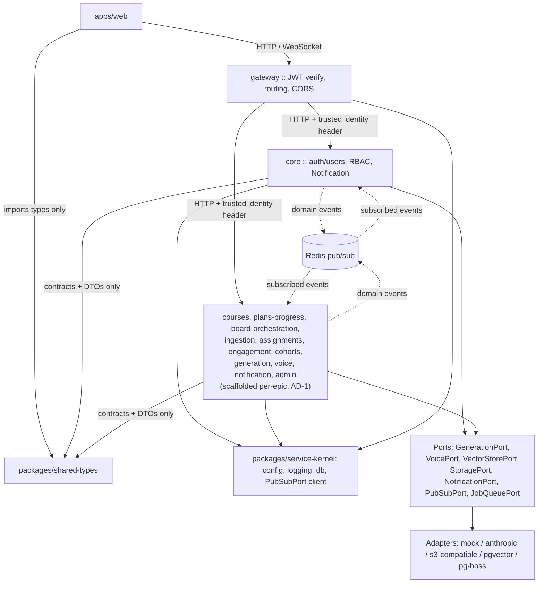
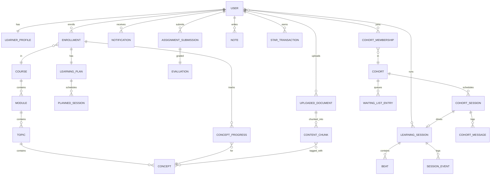

# Architecture Spine — Usavvy

## Design Paradigm

**Microservices** — each backend bounded context (per the ownership table, AD-14) is its own independently-deployable service under `services/*`, with its own process, port, and database. A `gateway` service is the single entry point for `apps/web` (BFF: JWT verification, request routing/aggregation, CORS). Internally, each service still applies hexagonal ports-and-adapters at every external integration boundary (LLM generation, TTS/ASR, retrieval, object storage, notifications, realtime pub/sub, async jobs) — a service depends on `packages/service-kernel` (config, logging, db, Redis pub/sub client) and on **ports**, never on a concrete adapter. Adopted 2026-08-04 (pivoted from an initially-planned modular monolith) specifically so high-load capabilities — `generation`, `voice`, `board-orchestration` — can scale and deploy independently of low-load ones, per the user's explicit request for a project structure that scales and handles load without tight coupling.

Cross-service communication is never a TypeScript import — see AD-13's inter-service rule. This is the microservices-specific tightening of the module-boundary principle a modular monolith enforces only by lint convention (an `index.ts`-only import rule); here it's structurally impossible to violate, since there is no shared process to import across.

## Invariants & Rules

### AD-1 — Microservices, each internally hexagonal (ports-and-adapters)

- **Binds:** every `services/*` process; generation, voice, retrieval, storage, and notification integrations within each
- **Prevents:** a service hard-depending on a specific vendor SDK, making swap (NFR-10, R-10) or config-driven behavior impossible; and any service reaching around another's HTTP API to call a vendor adapter it doesn't own
- **Rule:** each backend bounded context is its own deployable service under `services/<name>` (list: `gateway`, `core` [auth/users], `courses`, `plans-progress`, `board-orchestration`, `ingestion`, `assignments`, `engagement`, `cohorts`, `generation`, `voice`, `notification`, `admin` — 1:1 with AD-14's ownership rows, plus `gateway` as the BFF entry point). Within a service, any code consuming generation, voice, retrieval, storage, or notification capability depends only on its Port interface (`GenerationPort`, `VoicePort`, `VectorStorePort`, `StoragePort`, `NotificationPort`). Concrete adapters (`generation/mock`, `generation/anthropic`, `voice/mock`, `storage/minio-compatible`, `notification/mock`, `vectorstore/pgvector`) implement a port and are wired in by config (AD-12) — never imported directly. A `mock` adapter is the default binding for generation, voice, and notification until a real provider is configured. `VectorStorePort` calls carry a required metadata contract (`documentId`, `courseId`, `conceptId`, `chunkId`) defined in `packages/shared-types` — `ingestion` (writer) and `generation` (reader) share this contract via their HTTP contract rather than each inventing their own chunk-tagging scheme. **Scaffold-on-demand:** only `gateway` and `core` are built as part of Story 1.0; every other service's folder is created when its owning epic starts (same "don't pre-build for stories that haven't started" convention Story 1.0 already applies to individual module code) — a `services/*` directory that doesn't exist yet simply hasn't had its epic started.

### AD-2 — Generation caching, tiered routing, and rate-limiting are GenerationPort responsibilities

- **Binds:** `GenerationPort` and every module that calls it (board-orchestration, ingestion, assignments)
- **Prevents:** a module bypassing the cache/routing/rate-limit layer and calling a model adapter directly — the PRD names cache-first Beats + tiered routing as the primary lever for both NFR-B-1/B-2 latency budgets and the cost-per-learner-hour target (§10.6 R3, NFR-22/23, R-2 "critical/high"), and NFR-18's abuse protection is the same class of cross-cutting concern
- **Rule:** `GenerationPort` itself owns cache-first resolution (pre-generated Beats for catalog content at standard depth), tiered model routing (small model for simple branches, large model for authoring/deep branches), **and** rate-limiting/abuse-protection enforcement. No module calls a generation adapter directly or implements its own throttling — caching, routing, and limits are enforced once, at the port. Only the specific thresholds/algorithm are left to epic-altitude tuning, against the NFR-24/Principle-6 constraint that ceilings must be "expressed generously and only enforced against abuse patterns" — never encountered by a genuine learner.

### AD-3 — PII redaction and content-safety enforcement at a single choke point

- **Binds:** `GenerationPort`, `VoicePort`, and any human-authored real-time content (cohort chat, future peer messaging)
- **Prevents:** board narration, assignment feedback, ask-anything, and cohort chat each implementing their own ad hoc PII/safety handling — exactly the divergence a shared choke point exists to prevent, and a gap where human-to-human chat (arguably the likeliest place for a genuine crisis disclosure) has no safety owner at all
- **Rule:** `GenerationPort`/`VoicePort` implementations apply PII minimization (NFR-17) and content-safety filtering, including mandatory self-harm/crisis escalation to a static support-resources page (NFR-19, "never an improvised AI response"), before any request leaves the process and before any response reaches a calling module. Human-authored real-time messages (cohort chat) route through the same safety-filtering logic via a shared `SafetyFilter` call even though no generation call occurs — safety enforcement is a property of the content, not of which port it happened to pass through. No feature module implements its own redaction or safety logic.

### AD-4 — User-facing text: static copy vs. generated content are two distinct rules

- **Binds:** `apps/web`, every `services/*` (UI copy, notifications, error messages) and `GenerationPort`/`VoicePort` (Beat narration, generated feedback)
- **Prevents:** English text baked directly into components/templates, which would block adding Hindi + 2 more languages later without a rewrite (§3.3, NFR-12) — and conflating that static-string problem with the separate problem of "what language does the AI generate content in"
- **Rule:** (a) *Static copy* — all user-facing UI/notification/error text resolves through a locale layer via lookup key; only a single English bundle ships at launch; no module concatenates or hardcodes a user-facing string inline. (b) *Generated content* — every `GenerationPort`/`VoicePort` call carries a required `locale`/`language` parameter, enforced at the port per AD-2/AD-3's pattern; a `generation` or `voice` engineer cannot ship a call site that omits it. Locale library and translation tooling are Deferred.

### AD-5 — Realtime transport, pub/sub abstraction, and message contracts

- **Binds:** Board streaming (FR-B-*), cohort live sessions (FR-G-9..17), narration audio delivery
- **Prevents:** building a second, heavier realtime transport (WebRTC/media servers) nothing requires; a hard dependency on single-instance fan-out that would require a rewrite to meet NFR-3's "must scale horizontally to 10×"; and independently-built WS payloads drifting from each other or leaking internal fields
- **Rule:** all realtime fan-out (Beat streaming, cohort board sync, chat, polls, live narration audio) goes over WebSocket, server-authoritative — no WebRTC in v1. Fan-out itself goes through a `PubSubPort` backed by **Redis pub/sub, active from day one** (not deferred — the microservices pivot (AD-1) makes cross-process fan-out and cross-service domain-event delivery a day-one requirement, not a later-scale optimization; previously this was a Deferred single-instance→Redis swap, now there is no single instance to begin with). Every WS message type is a named, versioned contract defined in `packages/shared-types`, structurally distinct from internal domain-event/entity shapes — never a raw serialization of an internal `Beat`/`LearningSession` entity (this is how internal fields like model-routing tier or per-call cost stay out of client payloads). Narration audio streams progressively over the same Beat WebSocket channel with word-level timing (matching the PRD's own §19 direction and the NFR-B-4 ≤200ms drift budget) — it is never a `StoragePort`-hosted file the client fetches after the fact; `StoragePort` (AD-6) is for durable artifacts only (recordings, exports), never live narration.

### AD-6 — Object storage behind a StoragePort

- **Binds:** UploadedDocument, assignment submissions, board exports, session recordings — durable artifacts only, never live narration audio (AD-5)
- **Prevents:** filesystem-path assumptions or a vendor SDK leaking into domain code
- **Rule:** all file reads/writes go through `StoragePort`. Dev binds to an S3-compatible self-hosted adapter (Stack table); a hosted S3/GCS adapter is a config swap, no domain code change.

### AD-7 — RBAC module: config-seeded roles, DB-assigned, role-level only in v1

- **Binds:** all authenticated routes and UI gating
- **Prevents:** role/permission checks scattered as ad-hoc string comparisons across modules, roles hardcoded where they can't be extended without a code change, and an `admin` back-office feature (per-user permission overrides) being built against a data path `auth` never agreed to serve
- **Rule:** roles are `SuperAdmin`, `Admin`, `Mentor`, `Student` (the PRD's Content-Ops and Admin/Moderation personas both map to `Admin`; split later only if their permission sets diverge materially). The role list and default permission matrix live in `packages/config` as versioned seed data; a user's assigned role(s) live in the DB (`core`, per AD-14). Every authorization check goes through one guard, `can(user, action, resource)`, evaluated purely from `role → permission matrix` — **no per-user/per-resource permission overrides exist in v1**; an admin UI must not be built assuming one until a follow-on AD adds it. Auth is JWT (access + refresh), custom-built. **Under the microservices paradigm (AD-1), the JWT is verified exactly once, in `gateway`'s Fastify `preHandler` hook** — `gateway` then forwards a trusted internal identity header (user id + roles) to whichever downstream service it routes to, over the private docker network; downstream services trust that header rather than re-verifying the JWT on every hop. A service reachable only from `gateway` (never directly from `apps/web`) is how that trust boundary is enforced in dev — no downstream service binds its port to a public interface.

### AD-8 — Test structure mirrors source structure 1:1

- **Binds:** `apps/web`, every `services/*`, `packages/*`
- **Prevents:** tests drifting from the module boundaries they're meant to verify, making coverage gaps invisible
- **Rule:** each app/service/package has its own `tests/` tree that mirrors its own `src/` path-for-path (`tests/modules/x/y.test.ts` ↔ `src/modules/x/y.ts`) — never a shared cross-service test tree, matching the "no shared process" rule in AD-13. Vitest for unit/component, React Testing Library for FE components, Playwright for e2e.

### AD-9 — No dead code and no boundary violations, enforced mechanically

- **Binds:** `apps/web`, every `services/*`, `packages/*`
- **Prevents:** unused exports, unreachable branches, circular imports, stray adapter imports (AD-1), cross-service TypeScript imports (AD-13), and hardcoded user-facing strings (AD-4) accumulating silently instead of failing the build
- **Rule:** TypeScript `strict: true` everywhere; ESLint with `no-unused-vars`, `no-unreachable`, `import/no-cycle` as build-breaking errors; `eslint-plugin-boundaries` (or `import/no-restricted-paths`) configured to enforce AD-1's port-only imports, each module-within-a-service's `index.ts`-only public surface, and — the microservices-specific rule — that no file under `services/<a>/src/**` may import anything from `services/<b>/src/**` for any `a != b`; the only legal ways to reach another service are an HTTP call via `packages/shared-types` DTOs or a subscribed Redis event (AD-13). This is checked at lint time as a defense-in-depth backstop — it's already structurally near-impossible since each service is a separate `package.json`/workspace with no dependency on another service's package. An i18n lint rule flags string literals in JSX/user-facing paths that bypass AD-4's locale layer. A Husky pre-commit hook runs all of it. Backstopped by `bmad-code-review` at story time.

### AD-10 — Entity naming disambiguates the PRD's "Session" collision

- **Binds:** data model, all modules referencing scheduling or live playback
- **Prevents:** one module building against "the calendar slot" and another against "the live Beat-playback run" under the same name
- **Rule:** the PRD's live teaching run (Beats, replay, pause) is `LearningSession`; the PRD's `ScheduledSession` (a plan's future calendar slot, not yet started) is `PlannedSession`; `CohortSession` is unchanged. No code or schema uses the bare term `Session`.

### AD-11 — Local-only dev environment, no deployment target yet

- **Binds:** local dev setup
- **Prevents:** dev-environment sprawl (containerizing every service) that slows the fast-iteration loop the phased/visible-together goal depends on; and the microservices pivot (AD-1) being read as "therefore containerize everything in dev," which would recreate exactly the Docker-rebuild-per-change loop this AD exists to avoid
- **Rule:** one `docker-compose.yml` runs only stateful deps — Postgres+pgvector (one server, one database per service per AD-14), Redis (AD-5), the S3-compatible storage adapter. Every `services/*` process and `apps/web` run natively (`tsx watch`, `vite dev`) for fast HMR, not containerized in dev — real inter-service HTTP/Redis traffic over `localhost` ports proves the microservices communication pattern genuinely works, without paying a container-rebuild tax on every code change. `pnpm dev` runs all currently-scaffolded services plus `web` concurrently (extends as each new service is scaffolded per AD-1's scaffold-on-demand rule). Per-service independent container deployment is Deferred alongside the rest of the deployment topology.

### AD-12 — Config-driven runtime behavior: boot-time structure vs. live-toggleable flags

- **Binds:** all modules, all adapters, `admin` back-office
- **Prevents:** `process.env` reads scattered through business logic; untyped/unvalidated config; and an `admin` "toggle this feature" UI silently doing nothing because it was built against a config model that only reloads on restart
- **Rule:** structural configuration (active adapter per port, RBAC seed data) is defined in `packages/config` with a `zod` schema, loaded and validated once at process boot — no module reads `process.env` directly. Operator-facing feature flags are a distinct, explicitly DB-backed sub-system: read on each request (or push-invalidated), still `zod`-validated, and exempt from the "loaded once at boot" clause — an `admin` toggle takes effect live, by design.

### AD-13 — Service boundary, inter-service communication, and state-fact propagation

- **Binds:** every `services/*`, `apps/web`, `packages/shared-types`, `packages/service-kernel`
- **Prevents:** one service reaching into another's database or internal code, or writing a foreign key into a table it doesn't own; the frontend importing backend implementation details or any service's internals directly; and a state change (mastery, submission-graded, session-completed) that other services depend on being delivered only via a direct call that a listening service never subscribed to
- **Rule:** see diagram. Cross-service communication happens only two ways: (a) a **synchronous HTTP call** to another service's public API using request/response DTOs defined in `packages/shared-types` (via a thin typed fetch wrapper, not raw `fetch` scattered per call site — this is what keeps a caller decoupled from HTTP mechanics, matching AD-1's port philosophy), or (b) a **published domain event on Redis pub/sub** (AD-5) — never a direct import of another service's code (there is none to import — separate `package.json`, separate process), and never a schema write (FK, migration, or even a read) into a database owned by another service (see AD-14's ownership map; enforced physically by database-per-service, not just convention). Any state transition other services are known to consume **must** additionally be published as a domain event on Redis, regardless of whether a synchronous call also occurred — event emission is not optional just because a caller also invoked the HTTP API directly. `apps/web` imports only `packages/shared-types` and talks HTTP/WebSocket only to `gateway`, never directly to any other service.
- **Public surface, mechanically enforced:** within a service, code is further organized into `modules/<name>/` folders (mirroring the pre-pivot module-boundary discipline at a smaller scale — e.g. `core`'s own `auth` vs `notification` code should still stay decoupled from each other even though they now share a process); each module's *only* importable file from outside itself is its `index.ts` barrel. `shared-kernel` (now `packages/service-kernel`, a real shared package) is exempt — every service depends on it directly; it has no "owner" to be decoupled from. AD-9's `eslint-plugin-boundaries` config is where both the intra-service and inter-service (no `services/a` importing `services/b`) rules are actually enforced — see AD-9.



### AD-14 — Entity ownership and database-per-service

- **Binds:** every service that reads or writes a shared ERD entity
- **Prevents:** two services each believing they own the same entity (duplicate tables, duplicate writers), or a service reaching around AD-13 by writing a foreign key into a table another service owns
- **Rule:** every ERD entity has exactly one owning service (table below), and that service's database is the *only* database that entity's table lives in — **database-per-service**: each service gets its own Postgres database (schema-level isolation; one shared Postgres server container in dev for resource economy — a separate physical server per service is a Deferred infra swap, not a code change). Any other service accesses an entity it doesn't own only through the owner's HTTP API or a subscribed domain event (AD-13) — never a direct schema reference, cross-database query, or FK into a table it doesn't own. `COHORT_SESSION` references the canonical "current beat" pointer owned by `board-orchestration` (via `LEARNING_SESSION`/`BEAT`) through that service's API, it does not maintain its own parallel playback state or a local copy of `board-orchestration`'s tables.

| Entity | Owning service |
| --- | --- |
| User, LearnerProfile, Notification | core (auth/users) |
| Enrollment, Course, Module, Topic, Concept | courses |
| LearningPlan, PlannedSession, ConceptProgress | plans-progress |
| LearningSession, Beat, SessionEvent | board-orchestration |
| UploadedDocument, ContentChunk | ingestion |
| AssignmentSubmission, Evaluation | assignments |
| Note, StarTransaction, Badge, Streak | engagement |
| Cohort, CohortMembership, CohortSession, CohortMessage, WaitingListEntry | cohorts |

### AD-15 — Async job queue is a first-class port

- **Binds:** ingestion pipeline (PRD §19: "parse → OCR → structure → chunk → embed → outline"), long-form assignment grading (FR-E-13, up to 10 min), catalog Beat pre-generation (R3)
- **Prevents:** ingestion and a future assignments-evaluation pipeline independently inventing incompatible async patterns (DB-polling vs. ad hoc timers vs. a real queue), each with its own retry/failure semantics
- **Rule:** durable background work goes through a `JobQueuePort`. Dev/default adapter is `pg-boss` (Postgres-native, no extra infra beyond the database already running, free/OSS) — a dedicated queue (e.g. Redis-backed) is a config-only swap if scale later demands it.

### AD-16 — MVP analytics query the operational store directly

- **Binds:** Epic 8 (FR-O-6 funnel/retention/telemetry, FR-O-7 concept-difficulty heatmap, FR-O-8 AI-quality dashboard, FR-O-9 thumbs feedback)
- **Prevents:** a launch-blocking data-infrastructure question (where does Epic 8 read from) sitting silently undecided
- **Rule:** at MVP scale, Epic 8's analytics read `SessionEvent`, `ConceptProgress`, and related operational tables directly (read replica once load requires it) — no separate analytics warehouse in v1. A dedicated warehouse is Deferred, revisit when query load or retention requirements outgrow the operational store.

### AD-17 — No silent failures

- **Binds:** all modules, all adapters
- **Prevents:** an exception or error path that reaches neither the user nor a log — the specific failure mode NFR-25 exists to close off
- **Rule:** every `catch` block does one of two things: re-throws/maps to a user-facing error state (per the `error` envelope in Consistency Conventions and EXPERIENCE.md's "retry, never a dead end" state pattern), or logs via the shared-kernel logger with enough context (module, entity id, correlation id) to trace the failure — doing neither is a defect, not an acceptable shortcut. Enforced mechanically alongside AD-9: an ESLint rule forbidding empty catch blocks and catch blocks that neither log nor re-throw/return an error result, build-breaking like the rest of AD-9's toolchain.

### AD-18 — Notification Center and Activity History are read-projections, not new sources of truth

- **Binds:** `auth/users`' `Notification` entity (FR-A-10); the learner-facing Activity History view (FR-A-11)
- **Prevents:** Activity History becoming a second, divergent copy of data other modules already own (the exact class of problem AD-14 exists to prevent), and the Notification Center becoming a second delivery mechanism competing with `NotificationPort`
- **Rule:** the Notification Center persists in-app notification records (`Notification`, owned by `auth/users`) alongside `NotificationPort`'s existing email channel — one port, two channels, one record per in-app notification, referencing the domain event/process that triggered it so "is this tied to an in-progress process" (FR-A-10's clear-blocking rule) is a lookup, not a guess. Activity History reads `SessionEvent` (board-orchestration), `AssignmentSubmission` (assignments), and attendance data (cohorts) directly, the same read-only cross-module pattern AD-16 already established for analytics — it does not duplicate that data into a new table. `LearningSession`'s existing pause/resume lifecycle (Story 3.1) is the source for "session ended," extended with one additional domain event (`learning_session.ended`) so Activity History (and NFR-26's "checkable later" requirement generally) has a defined completion signal to key off, rather than inferring one from raw `SessionEvent` rows.

## Consistency Conventions

| Concern | Convention |
| --- | --- |
| Naming (entities, files, interfaces, events) | TS types PascalCase; DB tables/columns snake_case; REST routes kebab-case; domain events past-tense (`concept.mastered`, `beat.played`) |
| Data & formats (ids, dates, error shapes, envelopes) | IDs are UUIDv7 (time-ordered); all timestamps ISO 8601 UTC; errors as `{ error: { code, message, details? } }` from one central error-mapper, never per-route ad hoc shapes; monetary/cost values as integer smallest-unit (for NFR-22 cost dashboard) |
| State & cross-cutting (mutation, errors, logging, config, auth) | DB writes only through the owning module's service layer (AD-14), never from route handlers directly; structured JSON logging via shared-kernel logger; no silent failures (AD-17); config per AD-12; auth/authorization per AD-7 |
| Concurrency control | every mutable entity carries an `updated_at`/`version` column; a write whose expected version doesn't match current state is rejected with a `409` via the central error-mapper, never a silent last-write-wins overwrite |

## Stack

| Name | Version |
| --- | --- |
| Node.js | 24 LTS |
| TypeScript | 6.x (strict) |
| Fastify | 5.x |
| React | 19.x |
| Vite | 8.x |
| pnpm | 11.x (workspaces) |
| PostgreSQL | 18.x + pgvector extension (0.8.x) |
| Drizzle ORM | latest stable |
| Vitest / React Testing Library / Playwright | latest stable |
| S3-compatible object storage (dev) | SeaweedFS (actively maintained; MinIO's OSS edition was discontinued in the lead-up to this spine and is not a safe pin — swap is config-only via `StoragePort`, AD-6) |
| pg-boss | latest stable (Postgres-native job queue, AD-15) |
| Redis | latest stable (8.x) — `PubSubPort` adapter, active from day one (AD-5); free/self-hosted via `docker-compose` |

## Structural Seed

Every `modules/<name>/` folder *within* a service exposes exactly one public entry point, `index.ts`; everything else inside it is private to that module (AD-13). Every `services/<name>` is its own workspace package (own `package.json`, own `tests/` mirroring its own `src/` 1:1 per AD-8) — there is no shared backend workspace to reach across.

```text
usavvy/
  apps/
    web/                       # React + Vite SPA
      src/
        modules/                # mirrors backend service boundaries in UI terms
          auth/
          board/
          courses/
          plans/
          cohorts/
          assignments/
          engagement/
          admin/
        shared/                 # design system, layout, cross-module UI
        app/                    # routing, providers, entry, persistent nav shell
                                 # (Story 1.12) — the one place app-wide chrome lives
      tests/                    # mirrors src/ 1:1 (AD-8)
  services/                     # each an independently-deployable Fastify + TypeScript backend (AD-1)
    gateway/                    # BFF: JWT verify (AD-7), routing/aggregation to other services, CORS
      src/
      tests/                    # mirrors src/ 1:1 (AD-8)
    core/                       # auth/users: RBAC, JWT issuance (AD-7), User/LearnerProfile/Notification (AD-14)
      src/
        modules/
          auth/
          users/
          notification/          # NotificationPort + adapters (AD-1)
      tests/                    # mirrors src/ 1:1 (AD-8)
    courses/                   # scaffolded when Epic 2 starts (AD-1 scaffold-on-demand)
    ingestion/                  # + JobQueuePort consumer (AD-15); scaffolded when Epic 2 starts
    board-orchestration/       # the Lesson Orchestration "crown jewel" (PRD S19); owns LearningSession/Beat (AD-14); scaffolded when Epic 3 starts
    generation/                 # GenerationPort + adapters (AD-1, AD-2); scaffolded when Epic 3/4 starts
    voice/                      # VoicePort + adapters (AD-1); scaffolded when Epic 3 starts
    plans-progress/             # scaffolded when Epic 4 starts
    cohorts/                    # scaffolded when Epic 7 starts
    assignments/                # scaffolded when Epic 6 starts
    engagement/                 # scaffolded when its epic starts
    admin/                      # scaffolded when Epic 9 starts
  packages/
    shared-types/               # DTOs, Beat schema, WS message contracts, role/permission enums, event contracts — the only cross-service dependency
    config/                     # composable base config-schema builder + RBAC seed data (AD-12)
    service-kernel/             # shared by every service: structured logger, db-ping, storage-ping, PubSubPort client
  infra/
    docker-compose.yml           # Postgres (one server, one DB per service, AD-14), Redis (AD-5), SeaweedFS (AD-11) — local dev only, stateful deps only
```



**Deployment & environments:** local only at this stage (AD-11) — no cloud provider chosen, no staging/production topology defined. This is deliberate, not an oversight: real deployment is deferred until a workable slice exists, and the provider choice is entangled with OQ-2 (market/region, drives data residency under NFR-15) and the unit-cost model (NFR-22/23). See Deferred.

## Deferred

- **Cloud provider, staging/production topology, CI/CD pipeline, secrets management** — no deployment target exists yet; revisit once a workable vertical slice is ready to leave localhost, and once OQ-2 (market/region) is resolved (drives data residency, NFR-15).
- **Per-service independent container deployment** — dev runs every service natively (AD-11) for fast HMR; real per-service Docker images/deploy targets are part of the deployment-topology work above, not before a vertical slice is ready to leave localhost.
- **Separate physical Postgres server per service** — dev uses one Postgres server container hosting one database per service (AD-14); splitting to genuinely separate servers is a config/infra swap when a specific service's load actually demands it, not a code change.
- **Dedicated vector DB (e.g. Qdrant)** — pgvector is sufficient at current scale; swap is a `VectorStorePort` adapter change if retrieval performance demands it later.
- **Real LLM/TTS/ASR provider selection** — not yet chosen among Anthropic/OpenAI/other; ships behind `GenerationPort`/`VoicePort` with a `mock` adapter as the default until a provider is chosen and funded.
- **WebRTC** — explicitly rejected for v1 (AD-5); revisit only if a future requirement introduces live peer-to-peer audio/video.
- **Mentor role's permission scope** — RBAC structurally supports it (AD-7); what a Mentor can actually do is a product decision the PRD doesn't answer (it excludes live human tutors as a v1 non-goal). Flag to whichever epic first exercises this role.
- **Per-user permission overrides** — explicitly out of scope for v1 (AD-7); add a follow-on AD if the admin back office needs finer-grained control later.
- **Observability/APM tooling** — NFR-22's cost-per-learner-hour dashboard needs data collection; specific tool (e.g. OpenTelemetry backend) not chosen.
- **Analytics warehouse** — MVP reads the operational store directly (AD-16); revisit when query load or retention needs outgrow it.
- **Locale library / translation tooling** — AD-4 keeps the codebase translation-ready structurally; which i18n library and locale-data format is not yet chosen.
- **Payment/billing integration** — blocked on OQ-1 (monetisation model, explicitly unresolved upstream); no port or vendor chosen yet.
- **Epic 3 (Board) and Epic 5 (Cohorts) epic-altitude spines** — this initiative spine sets the invariants; both epics carry enough internal complexity (per the PRD's own risk register) to warrant their own inherited epic-altitude spine before story-writing.

## Process Conventions

- **Mock-first epic kickoff (added 2026-08-06, Sprint Change Proposal `sprint-change-proposal-2026-08-06.md`):** before a new epic's first backend story starts, build a click-through mocked-data UI covering that epic's core user journey and get explicit sign-off on it, then proceed story-by-story with real backend built behind it. Applies starting with Epic 3 — Epics 1-2 were already built vertical-slice-per-story and are not retroactively redone, aside from Story 1.12 retrofitting a persistent nav shell across their existing pages.
